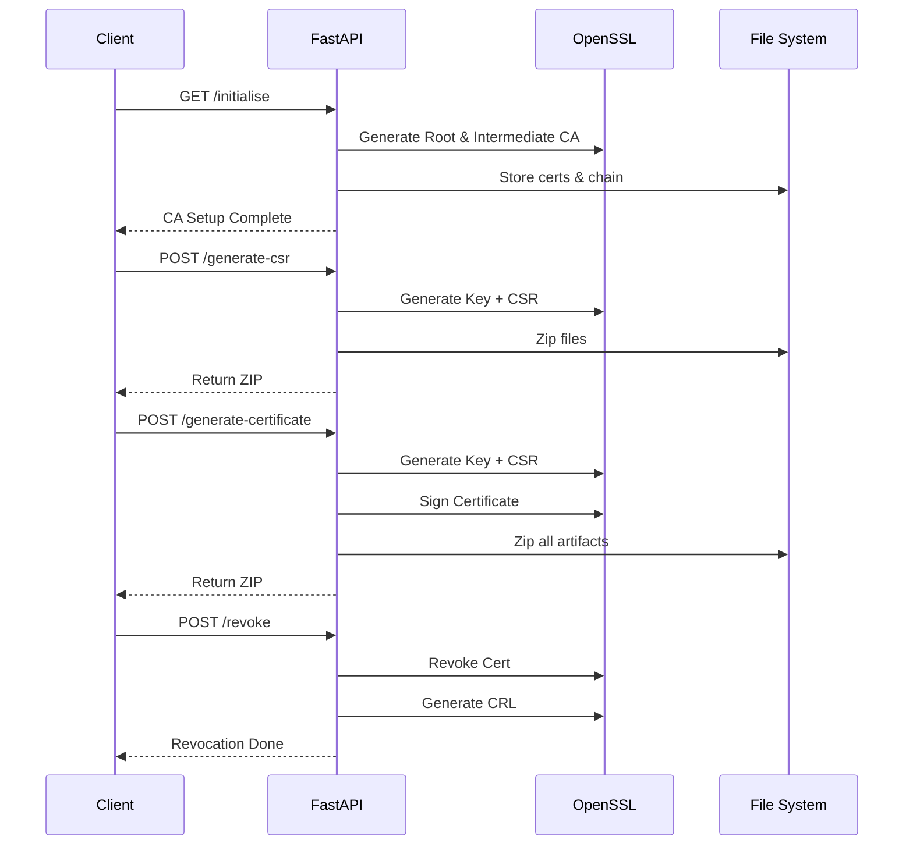

# PKI Certificate Management Service (FastAPI + OpenSSL)

This project is a lightweight **Public Key Infrastructure (PKI) service** built using FastAPI and OpenSSL. It allows you to:

* Initialize a Root CA and Intermediate CA
* Generate private keys and CSRs
* Issue signed certificates
* Revoke certificates and generate CRLs
* Download certificates as ZIP bundles

---

## 🚀 Features

* Root CA & Intermediate CA setup
* CSR generation
* Certificate signing via Intermediate CA
* Certificate revocation (CRL generation)
* ZIP packaging of cert artifacts
* Template-driven OpenSSL config (Jinja2)

---

## Project Structure

```
.
├── main.py
├── certshelper/
│   └── helper_functions.py
├── templates/
│   ├── rootca_openssl.cnf.jinja
│   ├── intermediateca_openssl.cnf.jinja
│   └── leafcert_openssl.cnf.jinja
```

---

## Prerequisites

* Python 3.9+
* OpenSSL installed
* Root privileges (required for `/root/pki` paths)

---

## How to Run the Application

You **must pass command-line arguments** for:

* Root CA Common Name
* Intermediate CA Common Name

### Start Command

```bash
python main.py --rootcacn "MyRootCA" --intercacn "MyIntermediateCA"
```

Or shorthand:

```bash
python main.py -r "MyRootCA" -i "MyIntermediateCA"
```

This will:

* Create required directory structure
* Render OpenSSL config files
* Prepare the environment before starting FastAPI server

---

## API Endpoints

### Initialize CA

```http
GET /initialise
```

Sets up:

* Root CA
* Intermediate CA
* CA Chain

---

### Generate CSR

```http
POST /generate-csr
```

#### Request Body:

```json
{
  "fqdn": "example.com",
  "sans": ["www.example.com", "api.example.com"]
}
```

#### Response:

* ZIP file containing:
  * Private key
  * CSR

---

### Generate Certificate

```http
POST /generate-certificate
```

#### Request Body:

```json
{
  "fqdn": "example.com",
  "sans": ["www.example.com", "api.example.com"]
}
```

#### Response:

* ZIP file containing:
  * Private key
  * CSR
  * Signed certificate
  * CA chain

---

### Revoke Certificate

```http
POST /revoke
```

#### Request Body:

```json
{
  "fqdn": "example.com"
}
```

#### Actions:

* Revokes certificate
* Updates CRL (`intermediate.crl.pem`)

---

## Sequence Diagram


## Future Improvements

* 🔑 Authentication & RBAC
* 🌐 CRL distribution endpoint
* ⚡ Async processing for OpenSSL
* 📊 Audit logging
* 🔄 Certificate rotation

---

## Author

Built as a hands-on PKI automation project using FastAPI and OpenSSL.

---

